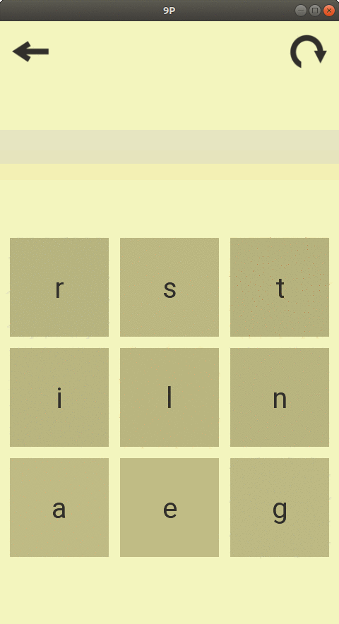

The Nine Puzzle (9P)
===================

.. image:: https://travis-ci.org/tube42/9P.svg
    :target: https://travis-ci.org/tube42/9P

This is a FOSS puzzle game for Android.

Assets
------

Art and design aren't really my strongest side.
Thankfully, this is an open source project and you can help if you want ;)

In any case, while the compiled assets are found under android/assets, the raw assets are include under the extra folder.
To compile assets you will need the following tools:

1. ImageMagic for converting PNG images
2. Inkscape for rendering SVG files

That is,

.. code:: shell

    sudo apt-get install imagemagick inkscape

To build the assets, you should do

.. code:: shell

    make setup
    make

